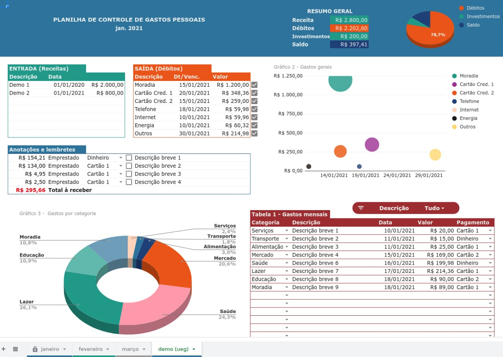

# :moneybag: Sistema Para Controle Financeiro

O sistema em questão tem por objetivo automatizar o controle de finanças pessoais.

Será utilizado como base uma planilha desenvolvida com este mesmo intuito. A planilha possui algumas limitações e a ideia é que o sistema possa contorna-las.

## Links Úteis
- :books: [Acompanhar Projeto](https://github.com/lucasdemoraesc/ueg-gestao-de-processos/projects/1)
- :eyes: [Documento de visão](Documento%20de%20visão.md)
- :clipboard: [Lista de requisitos](Lista%20de%20requisitos.md)
- :jigsaw: [Diagrama de classes](Diagrama%20de%20classes.png)

## Planilha de refência:

